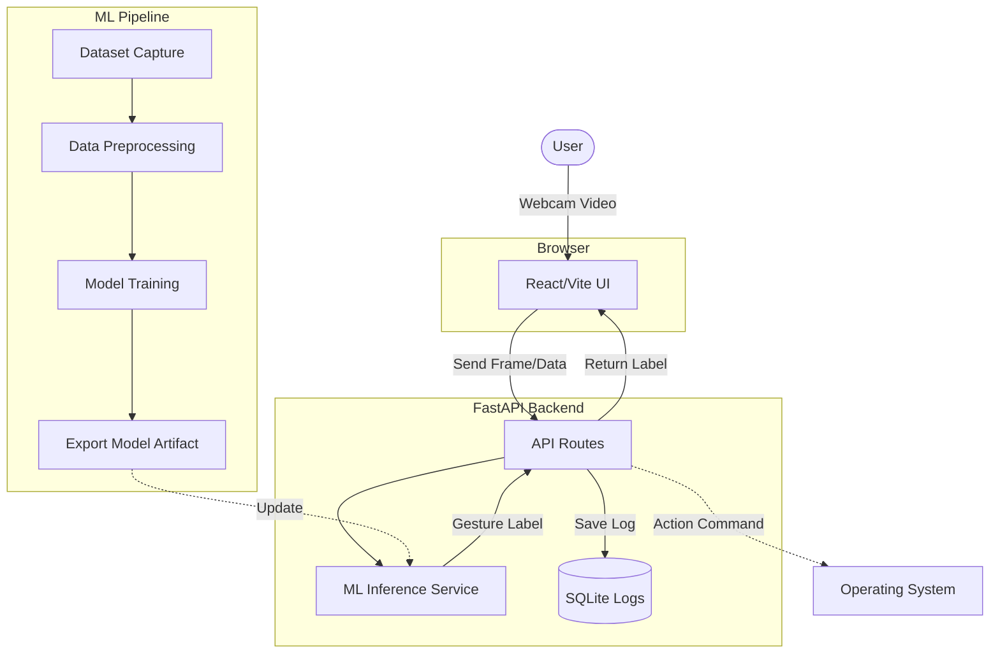

# GestureFlow

Full-stack human-computer interaction project for gesture recognition using a React frontend, FastAPI backend, and MediaPipe/OpenCV-based data and training pipeline.

## Modules
- `frontend/`: webcam UI, prediction display, action history, settings, and dataset capture screen.
- `backend/`: FastAPI API for health, inference, logging, dataset summary, and training stubs.
- `ml/`: dataset capture, preprocessing, training, evaluation, and export scripts.
- `docs/`: PRD and architecture documentation.
- `docker/`: containerization files.

## Architecture Map


## Quick Start
To run the entire application (both frontend and backend) instantly, simply open your terminal in the project root and run:
```bash
bash start.sh
```
This will automatically launch the servers. Then, open [http://localhost:5173/](http://localhost:5173/) in your browser, allow webcam access, and start using gestures!
